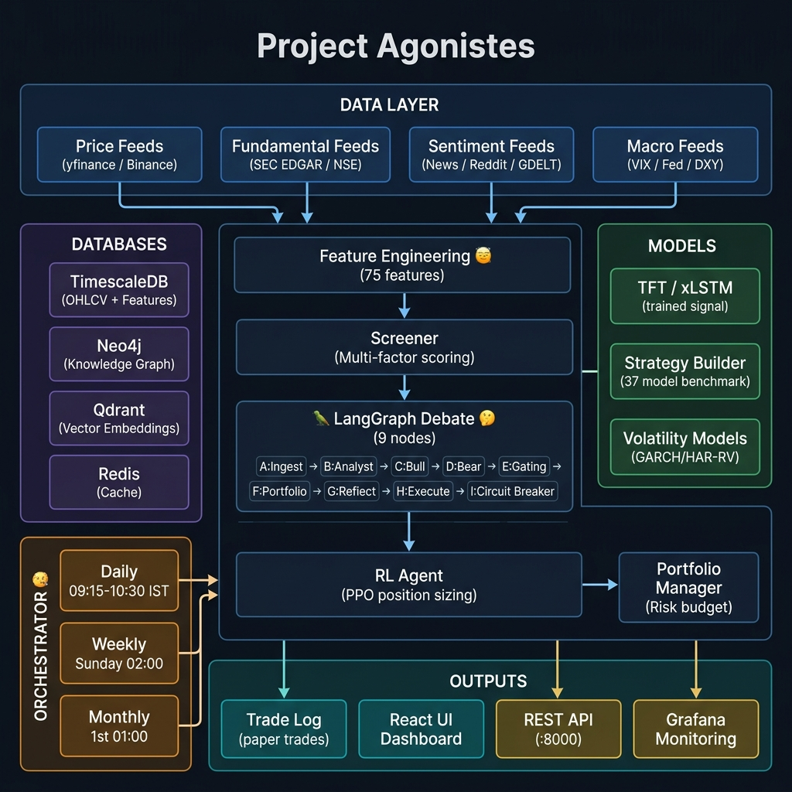
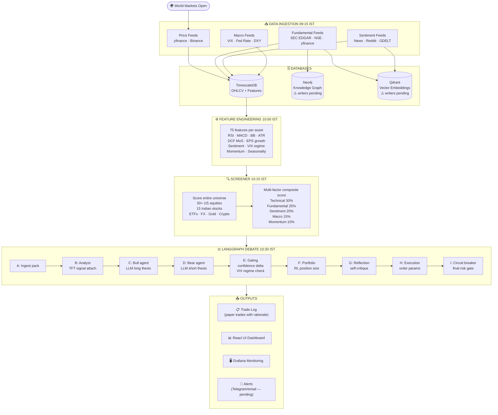
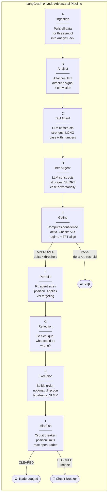
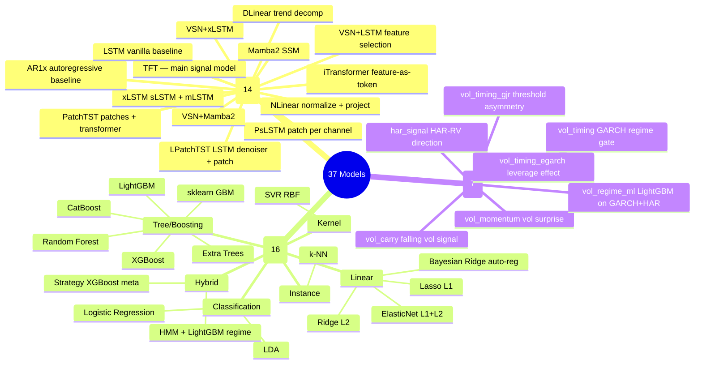
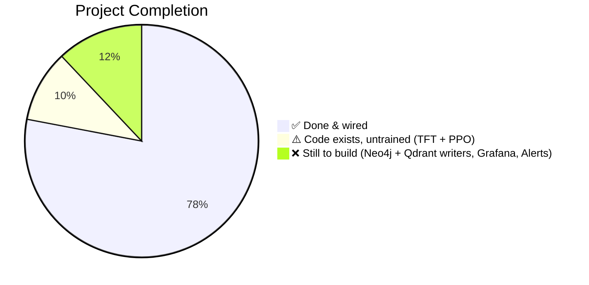

# Project Agonistes — Visual System Map



---

## 1. The Big Picture — What the System Does Daily



---

## 2. The LangGraph Debate — Node by Node



---

## 3. The Orchestrator Schedule — Who Kicks Off What

```mermaid
gantt
    title Orchestrator Weekly Schedule (IST)
    dateFormat  HH:mm
    axisFormat %H:%M

    section Monday–Friday Daily
    Ingest prices           :09:15, 15m
    Ingest fundamentals     :09:30, 5m
    Ingest news/sentiment   :09:35, 25m
    Build feature vectors   :10:00, 30m
    Screen + Debate         :10:30, 60m

    section Sunday (Weekly)
    Model drift check       :02:00, 30m
    Quick benchmark (4 models) :02:30, 90m

    section 1st of Month
    Full benchmark (37 models) :01:00, 240m
    Volatility regime review   :05:00, 60m
```



---

## 4. The Model Layer — What Each Model Does



---

## 5. What Each Database Stores

| Database | Port | What's in it | Who writes | Who reads |
|---|---|---|---|---|
| **TimescaleDB** | 5432 | OHLCV, feature vectors, trade log, gating log, fundamentals, sentiment, circuit breakers | All ingesters + orchestrator | Everything — primary store |
| **Neo4j** | 7687 | Company→Sector→Peer relationships, CEO/CFO nodes, S&P 500 / Nifty membership | ⚠️ `neo4j_writer.py` (pending) | `node_b_analyst.py` — enriches debate context |
| **Qdrant** | 6333 | Embedded: 10-K filings, earnings transcripts, past debate theses, news | ⚠️ `qdrant_writer.py` (pending) | `node_c_bull.py`, `node_d_bear.py` — semantic retrieval |
| **Redis** | 6379 | LangGraph state checkpoints, API rate limiter, short-term cache | LangGraph runtime | LangGraph runtime |

---

## 6. What Files Map to What Functions

```
orchestrator.py              ← THE BRAIN — runs everything on schedule
│
├── main.py                  ← CLI: backfill / features / screen / backtest / orchestrate
│
├── data_ingestion/
│   ├── price_feeds/         ← OHLCV from yfinance + Binance
│   ├── fundamental_feeds/   ← DCF, SEC filings, earnings, NSE/BSE
│   ├── sentiment_feeds/     ← News, Reddit, GDELT
│   ├── macro_feeds/         ← VIX, Fed rate, DXY, yield curve
│   ├── graph_feeds/         ← ⚠️ Neo4j writer (pending)
│   └── vector_feeds/        ← ⚠️ Qdrant writer (pending)
│
├── feature_engineering/     ← 75 features → TimescaleDB
│
├── screener/                ← Multi-factor scoring, top-N selection
│
├── langgraph_app/
│   └── src/nodes/           ← 9 nodes: A B C D E F G H I
│
├── transformer_model/       ← TFT architecture + inference (⚠️ untrained)
│
├── rl_agent/                ← PPO position sizer (⚠️ untrained)
│
├── strategy_builder/
│   ├── models.py            ← 14 neural encoders
│   ├── classical.py         ← 16 classical ML models
│   ├── volatility_models.py ← 7 vol models
│   ├── trainer.py           ← Pooled-Sharpe walk-forward training
│   ├── backtest.py          ← Oxford protocol metrics
│   └── run.py               ← Benchmark runner (37 models)
│
├── backtesting/             ← Strategy backtesting engine + regime tests
│
├── portfolio_manager/       ← Risk budgeting, position limits
│
├── core/
│   ├── db.py                ← Unified storage adapter (SQLite dev / TimescaleDB prod)
│   ├── api_server.py        ← REST API for React UI (9 endpoints)
│   └── logging.py           ← Structured logging
│
├── ui/                      ← React dashboard
│
├── monitoring/
│   ├── prometheus/          ← Metrics scraping config
│   └── grafana/             ← ⚠️ Dashboards (pending)
│
└── docker-compose.yml       ← TimescaleDB + Neo4j + Qdrant + (⚠️ Redis + Grafana pending)
```

---

## 7. Completion Status at a Glance



| Layer | Status | Blocker |
|---|---|---|
| Data ingestion (price, fundamental, sentiment, macro) | ✅ | — |
| Feature engineering (75 features) | ✅ | — |
| Screener | ✅ | — |
| LangGraph (all 9 nodes) | ✅ | — |
| RL Agent (PPO code) | ✅ code / ❌ trained | Needs GPU training |
| TFT model (code) | ✅ code / ❌ trained | Needs GPU training |
| Strategy builder (37 models) | ✅ | — |
| Backtesting engine | ✅ | — |
| REST API (9 endpoints) | ✅ | — |
| Orchestrator (daily/weekly/monthly) | ✅ | — |
| Docker compose (TS + Neo4j + Qdrant) | ✅ | — |
| **Neo4j writer pipeline** | ❌ | Next sprint |
| **Qdrant embedding pipeline** | ❌ | Next sprint |
| **Redis in Docker** | ❌ | Next sprint |
| **Grafana dashboards** | ❌ | Next sprint |
| **Alert system (Telegram)** | ❌ | Future |
| **RunPod API automation** | ❌ | Future |
