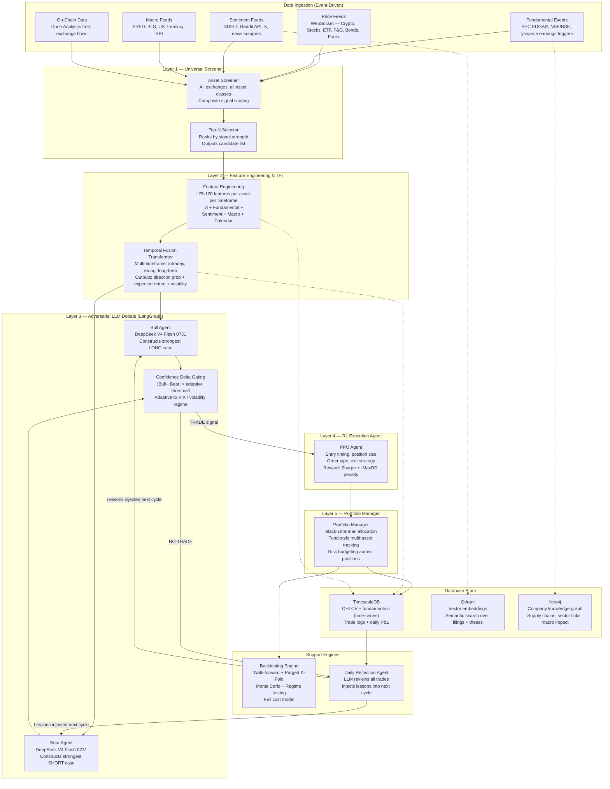
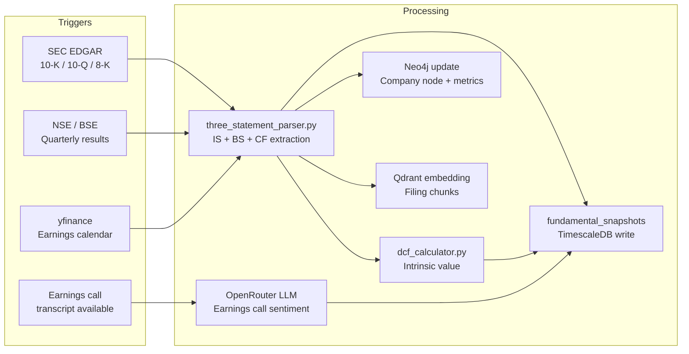

# Project Agonistes — Master Architecture Specification (v2)

> **Codename:** Project Agonistes
> **Target Runtime:** Local PC (32+ GB RAM, 8+ cores, ~500 GB SSD)
> **LLM Provider:** OpenRouter → `deepseek/deepseek-v4-flash-0731`
> **Phase 1 Goal:** Paper trading + backtesting validation across all timeframes

---

## Table of Contents

1. [Section 1 — System Architecture & Directory Layout](#section-1)
2. [Section 2 — Universal Asset Screener](#section-2)
3. [Section 3 — Feature Engineering Pipeline](#section-3)
4. [Section 4 — Transformer Signal Model (TFT)](#section-4)
5. [Section 5 — Adversarial LLM Debate Layer (LangGraph)](#section-5)
6. [Section 6 — RL Execution Agent (PPO)](#section-6)
7. [Section 7 — Portfolio Manager & Position Tracking](#section-7)
8. [Section 8 — Fundamental Data Pipeline & 3-Statement + DCF Dashboard](#section-8)
9. [Section 9 — Backtesting Engine](#section-9)
10. [Section 10 — Database Stack & Storage](#section-10)
11. [Section 11 — UI Dashboard](#section-11)
12. [Section 12 — Implementation Roadmap](#section-12)

---

<a id="section-1"></a>
## SECTION 1: System Architecture & Directory Layout

### 1.1 High-Level 5-Layer Architecture



### 1.2 Directory Layout (Local PC)

```
~/agonistes/
├── .env                             # OPENROUTER_API_KEY + DB passwords
├── docker-compose.yml               # TimescaleDB + Qdrant + Neo4j
├── pyproject.toml                   # Root Python project
│
├── data_ingestion/
│   ├── price_feeds/
│   │   ├── crypto_ws.py             # Binance/Coinbase/OKX/Bybit WebSocket
│   │   ├── equity_ws.py             # yfinance polling / NSE WebSocket
│   │   └── forex_ws.py              # Free FX feeds
│   ├── fundamental_feeds/
│   │   ├── sec_edgar_watcher.py     # Polls SEC EDGAR for new 10-K/10-Q/8-K
│   │   ├── nse_bse_watcher.py       # NSE/BSE filing event watcher
│   │   ├── yfinance_earnings.py     # Earnings calendar + surprise fetcher
│   │   ├── three_statement_parser.py# Parses IS + BS + CF from filings
│   │   └── dcf_calculator.py        # DCF intrinsic value calculator
│   ├── sentiment_feeds/
│   │   ├── gdelt_fetcher.py         # GDELT news events
│   │   ├── reddit_fetcher.py        # Reddit API
│   │   └── news_aggregator.py       # News headline scraper
│   ├── macro_feeds/
│   │   ├── fred_fetcher.py          # FRED macro data
│   │   ├── bls_fetcher.py           # CPI, jobs data
│   │   └── treasury_fetcher.py      # Yield curve
│   └── onchain_feeds/
│       ├── dune_fetcher.py          # Dune Analytics free tier
│       └── exchange_flow_fetcher.py # On-chain flows
│
├── screener/
│   ├── asset_universe.py            # All tradable instruments
│   ├── signal_scorer.py             # Composite signal scoring per asset
│   ├── top_n_selector.py            # Ranks assets, emits top-N candidates
│   └── screener_config.yaml
│
├── feature_engineering/
│   ├── technical_features.py        # RSI, MACD, ATR, Bollinger, VWAP, OBV
│   ├── fundamental_features.py      # EPS, DCF margin, ROIC, D/E
│   ├── sentiment_features.py        # Scored sentiment scalars
│   ├── macro_features.py            # VIX, DXY, yield curve
│   ├── onchain_features.py          # TVL, protocol revenue, flows
│   ├── calendar_features.py         # Earnings proximity, expiry, day-of-week
│   ├── cross_asset_features.py      # BTC dominance, sector rotation
│   └── feature_store.py             # Writes feature vectors to TimescaleDB
│
├── transformer_model/
│   ├── model.py                     # TFT definition (PyTorch + pytorch-forecasting)
│   ├── dataset.py                   # Reads feature store
│   ├── train.py                     # Training loop with walk-forward CV
│   ├── inference.py                 # Real-time inference
│   ├── shap_analysis.py             # SHAP feature importance + pruning
│   └── configs/
│       ├── tft_intraday.yaml
│       ├── tft_swing.yaml
│       └── tft_longterm.yaml
│
├── langgraph_app/
│   ├── src/
│   │   ├── graph_definition.py
│   │   ├── state.py
│   │   ├── nodes/
│   │   │   ├── node_a_ingestion.py
│   │   │   ├── node_b_analyst.py
│   │   │   ├── node_c_bull.py
│   │   │   ├── node_d_bear.py
│   │   │   ├── node_e_gating.py
│   │   │   ├── node_f_portfolio.py
│   │   │   ├── node_g_reflection.py
│   │   │   ├── node_h_execution.py
│   │   │   └── node_i_mirofish.py
│   │   ├── schemas/
│   │   └── utils/
│   │       ├── llm_client.py        # OpenRouter API wrapper
│   │       └── db_clients.py
│   └── pyproject.toml
│
├── rl_agent/
│   ├── environment.py               # Custom Gym environment
│   ├── agent.py                     # PPO agent (Stable-Baselines3)
│   ├── train_rl.py
│   ├── inference.py
│   ├── reward.py                    # Sharpe + MaxDD composite reward
│   └── configs/ppo_config.yaml
│
├── portfolio_manager/
│   ├── black_litterman.py
│   ├── position_tracker.py
│   ├── risk_budgeter.py
│   ├── pnl_calculator.py
│   └── multi_asset_ledger.py
│
├── backtesting/
│   ├── engine.py
│   ├── data_loader.py
│   ├── cost_model.py                # All market frictions
│   ├── walk_forward.py
│   ├── purged_kfold.py
│   ├── monte_carlo.py
│   ├── regime_tester.py
│   └── metrics/
│       ├── sharpe.py
│       ├── drawdown.py
│       ├── trade_stats.py
│       └── alpha_metrics.py
│
├── databases/
│   ├── docker-compose.yml
│   ├── timescaledb/init/001_schema.sql
│   ├── qdrant/config.yaml
│   └── neo4j/neo4j.conf
│
├── ui/
│   ├── pages/
│   │   ├── screener.tsx
│   │   ├── financials.tsx           # 3-Statement + DCF dashboard
│   │   ├── backtest_results.tsx
│   │   ├── portfolio.tsx
│   │   └── debate_viewer.tsx
│   └── components/
│       ├── DCFGauge.tsx
│       └── PerformanceCharts.tsx
│
├── monitoring/
│   ├── prometheus/prometheus.yml
│   └── grafana/dashboards/
│
└── scripts/
    ├── bootstrap.sh
    ├── start_all.sh
    └── run_backtest.sh
```

### 1.3 Service Map (All Local)

| Service | Endpoint | Notes |
|---|---|---|
| **OpenRouter LLM API** | `https://openrouter.ai/api/v1` | `deepseek/deepseek-v4-flash-0731` · $0.072/M input · 1M context |
| TimescaleDB | `localhost:5432` | PostgreSQL + time-series hypertables |
| Qdrant | `localhost:6333` | Vector similarity search |
| Neo4j | `localhost:7687` (Bolt) · `localhost:7474` (Browser) | GraphRAG knowledge graph |
| Prometheus | `localhost:9090` | Metrics scraping |
| Grafana | `localhost:3000` | Monitoring dashboards |
| UI Dashboard | `localhost:3001` | Main trading platform UI |

---

<a id="section-2"></a>
## SECTION 2: Universal Asset Screener

### 2.1 Asset Universe

| Asset Class | Sources | Approx. Count |
|---|---|---|
| Crypto spot | Binance, Coinbase, OKX, Bybit WebSocket | ~2,000 pairs |
| Crypto perps/futures | Binance Futures, Bybit, dYdX | ~500 contracts |
| US Equities | yfinance (S&P 500, NASDAQ, NYSE) | ~5,000 tickers |
| Indian Equities | NSE/BSE (Nifty 500 + broader) | ~2,000 tickers |
| ETFs | yfinance + ETF.com | ~3,000 ETFs |
| US Bonds/Treasuries | FRED + yfinance | ~50 instruments |
| Forex | Free FX feed | ~50 major pairs |
| Indian F&O | NSE derivatives | ~800 contracts |

### 2.2 Composite Signal Scorer

Each asset gets a **composite signal score (0–100)** updated on every event or price tick.

```python
# screener/signal_scorer.py
from dataclasses import dataclass

@dataclass
class AssetSignal:
    symbol: str
    asset_class: str  # CRYPTO, EQUITY_US, EQUITY_IN, ETF, BOND, FOREX, FNO

    # Component scores (0–100 each)
    technical_score: float
    fundamental_score: float
    sentiment_score: float
    macro_alignment_score: float
    momentum_score: float

    # Weights vary by asset class
    WEIGHTS = {
        "CRYPTO":    {"technical": 0.35, "fundamental": 0.10, "sentiment": 0.30, "macro": 0.15, "momentum": 0.10},
        "EQUITY_US": {"technical": 0.25, "fundamental": 0.35, "sentiment": 0.20, "macro": 0.10, "momentum": 0.10},
        "EQUITY_IN": {"technical": 0.25, "fundamental": 0.35, "sentiment": 0.20, "macro": 0.10, "momentum": 0.10},
        "ETF":       {"technical": 0.20, "fundamental": 0.30, "sentiment": 0.15, "macro": 0.25, "momentum": 0.10},
        "BOND":      {"technical": 0.10, "fundamental": 0.20, "sentiment": 0.10, "macro": 0.50, "momentum": 0.10},
        "FOREX":     {"technical": 0.30, "fundamental": 0.10, "sentiment": 0.20, "macro": 0.30, "momentum": 0.10},
        "FNO":       {"technical": 0.35, "fundamental": 0.25, "sentiment": 0.15, "macro": 0.10, "momentum": 0.15},
    }

    @property
    def composite_score(self) -> float:
        w = self.WEIGHTS[self.asset_class]
        return (
            self.technical_score    * w["technical"] +
            self.fundamental_score  * w["fundamental"] +
            self.sentiment_score    * w["sentiment"] +
            self.macro_alignment_score * w["macro"] +
            self.momentum_score     * w["momentum"]
        )
```

### 2.3 Top-N Selection Logic

```python
# screener/top_n_selector.py
N_CANDIDATES = 10
MIN_SCORE_THRESHOLD = 60.0
MAX_PER_ASSET_CLASS = 3      # Diversification cap

def select_top_n(signals: list[AssetSignal]) -> list[AssetSignal]:
    qualified = [s for s in signals if s.composite_score >= MIN_SCORE_THRESHOLD]
    qualified.sort(key=lambda s: s.composite_score, reverse=True)

    selected = []
    class_counts: dict[str, int] = {}

    for signal in qualified:
        if len(selected) >= N_CANDIDATES:
            break
        count = class_counts.get(signal.asset_class, 0)
        if count < MAX_PER_ASSET_CLASS:
            selected.append(signal)
            class_counts[signal.asset_class] = count + 1

    return selected
```

---

<a id="section-3"></a>
## SECTION 3: Feature Engineering Pipeline

### 3.1 Feature Categories Summary

For each asset in the Top-N shortlist, ~75–120 features are computed per timeframe and stored in TimescaleDB.

| Category | # Features | Update Frequency |
|---|---|---|
| Technical indicators | ~30 | Every price bar |
| Fundamental metrics | ~20 | On earnings event |
| Sentiment scores | ~10 | Every hour |
| Macro & cross-asset | ~10 | Every hour / on FRED event |
| Calendar / event proximity | ~5 | Daily |
| **Total** | **~75** | — |

### 3.2 Technical Features (~30)

```python
# feature_engineering/technical_features.py
import pandas as pd
import numpy as np
import ta

def compute_technical_features(ohlcv: pd.DataFrame) -> dict:
    close, high, low, vol = ohlcv["close"], ohlcv["high"], ohlcv["low"], ohlcv["volume"]
    f = {}

    # Momentum oscillators
    f["rsi_14"]         = ta.momentum.RSIIndicator(close, 14).rsi().iloc[-1]
    f["rsi_7"]          = ta.momentum.RSIIndicator(close, 7).rsi().iloc[-1]
    f["stoch_k"]        = ta.momentum.StochasticOscillator(high, low, close).stoch().iloc[-1]
    f["williams_r"]     = ta.momentum.WilliamsRIndicator(high, low, close).williams_r().iloc[-1]
    f["roc_10"]         = ta.momentum.ROCIndicator(close, 10).roc().iloc[-1]

    # Trend indicators
    macd = ta.trend.MACD(close)
    f["macd_line"]      = macd.macd().iloc[-1]
    f["macd_signal"]    = macd.macd_signal().iloc[-1]
    f["macd_histogram"] = macd.macd_diff().iloc[-1]
    f["ema_9"]          = ta.trend.EMAIndicator(close, 9).ema_indicator().iloc[-1]
    f["ema_21"]         = ta.trend.EMAIndicator(close, 21).ema_indicator().iloc[-1]
    f["ema_50"]         = ta.trend.EMAIndicator(close, 50).ema_indicator().iloc[-1]
    f["ema_200"]        = ta.trend.EMAIndicator(close, 200).ema_indicator().iloc[-1]
    f["price_vs_ema200_pct"] = (close.iloc[-1] / f["ema_200"] - 1) * 100
    f["adx_14"]         = ta.trend.ADXIndicator(high, low, close, 14).adx().iloc[-1]
    f["cci_20"]         = ta.trend.CCIIndicator(high, low, close, 20).cci().iloc[-1]

    # Volatility
    bb = ta.volatility.BollingerBands(close, 20, 2)
    f["bb_width"]       = ((bb.bollinger_hband() - bb.bollinger_lband()) / bb.bollinger_mavg()).iloc[-1]
    f["bb_pct_b"]       = bb.bollinger_pband().iloc[-1]
    f["atr_14"]         = ta.volatility.AverageTrueRange(high, low, close, 14).average_true_range().iloc[-1]
    f["atr_pct"]        = f["atr_14"] / close.iloc[-1]
    f["realized_vol_20"]= close.pct_change().rolling(20).std().iloc[-1] * np.sqrt(252)

    # Volume
    f["volume_z_score"] = (vol.iloc[-1] - vol.rolling(20).mean().iloc[-1]) / vol.rolling(20).std().iloc[-1]
    f["obv"]            = ta.volume.OnBalanceVolumeIndicator(close, vol).on_balance_volume().iloc[-1]
    vwap = (vol * (high + low + close) / 3).cumsum() / vol.cumsum()
    f["vwap_pct"]       = (close.iloc[-1] / vwap.iloc[-1] - 1) * 100

    # Multi-timeframe returns
    for n, label in [(1, "1bar"), (5, "5bar"), (20, "20bar"), (60, "60bar")]:
        if len(close) > n:
            f[f"return_{label}"] = (close.iloc[-1] / close.iloc[-n] - 1) * 100

    return f
```

### 3.3 Fundamental Features (~20)

```python
# feature_engineering/fundamental_features.py

def compute_fundamental_features(symbol: str, asset_class: str, db) -> dict:
    snap = db.query_latest_fundamentals(symbol)
    if not snap or asset_class == "CRYPTO":
        return _crypto_onchain_features(symbol, db)

    f = {}

    # Earnings quality
    f["eps_surprise_pct"]     = snap.eps_actual / snap.eps_estimate - 1 if snap.eps_estimate else 0
    f["eps_yoy_growth"]       = snap.eps_yoy_growth
    f["revenue_surprise_pct"] = snap.revenue_actual / snap.revenue_estimate - 1 if snap.revenue_estimate else 0
    f["revenue_yoy_growth"]   = snap.revenue_yoy_growth

    # Profitability
    f["ebitda_margin"]        = snap.ebitda / snap.revenue if snap.revenue else 0
    f["fcf_yield"]            = snap.free_cash_flow / snap.market_cap if snap.market_cap else 0
    f["roic"]                 = snap.roic
    f["gross_margin"]         = snap.gross_profit / snap.revenue if snap.revenue else 0

    # Valuation
    f["forward_pe"]           = snap.forward_pe
    f["peg_ratio"]            = snap.peg_ratio
    f["dcf_margin_of_safety"] = (snap.dcf_intrinsic_value / snap.current_price - 1) if snap.current_price else 0
    f["ev_to_ebitda"]         = snap.ev_to_ebitda

    # Balance sheet health
    f["debt_to_equity"]       = snap.debt_to_equity
    f["interest_coverage"]    = snap.interest_coverage_ratio
    f["current_ratio"]        = snap.current_ratio

    # Corporate actions
    f["insider_buy_sell_ratio"]  = snap.insider_buy_value / snap.insider_sell_value if snap.insider_sell_value else 1.0
    f["inst_ownership_change"]   = snap.institutional_ownership_change_pct
    f["earnings_call_sentiment"] = snap.transcript_sentiment_score

    # Historical trend features (from TimescaleDB quarterly history)
    history = db.query_fundamental_history(symbol, quarters=8)
    if len(history) >= 4:
        recent = [h.ebitda_margin for h in history[:4]]
        prior  = [h.ebitda_margin for h in history[4:8]]
        f["margin_trend"]  = sum(recent) / 4 - sum(prior) / 4
        f["revenue_accel"] = history[0].revenue_yoy_growth - history[3].revenue_yoy_growth

    return f
```

### 3.4 Sentiment Features (~10)

```python
# feature_engineering/sentiment_features.py

def compute_sentiment_features(symbol: str, db) -> dict:
    recent = db.query_sentiment_events(symbol, hours=24)
    if not recent:
        return {"sentiment_score": 0.0, "sentiment_volume": 0, "sentiment_momentum": 0.0}

    scores  = [e.score for e in recent]          # [-1.0, +1.0]
    weights = [e.source_weight for e in recent]

    f = {}
    f["sentiment_score"]        = sum(s * w for s, w in zip(scores, weights)) / sum(weights)
    f["sentiment_volume"]       = len(recent)
    f["sentiment_positive_pct"] = sum(1 for s in scores if s > 0.2) / len(scores)
    f["sentiment_negative_pct"] = sum(1 for s in scores if s < -0.2) / len(scores)
    f["sentiment_momentum"]     = f["sentiment_score"] - db.query_sentiment_avg(symbol, hours=72)

    gdelt  = [e.score for e in recent if e.source == "GDELT"]
    reddit = [e.score for e in recent if e.source == "REDDIT"]
    news   = [e.score for e in recent if e.source == "NEWS"]

    f["gdelt_sentiment"]  = sum(gdelt)  / len(gdelt)  if gdelt  else 0.0
    f["reddit_sentiment"] = sum(reddit) / len(reddit) if reddit else 0.0
    f["news_sentiment"]   = sum(news)   / len(news)   if news   else 0.0
    f["sentiment_extreme"] = float(abs(f["sentiment_score"]) > 0.7)

    return f
```

### 3.5 Macro & Calendar Features (~15 combined)

```python
# feature_engineering/macro_features.py

def compute_macro_features(db) -> dict:
    macro = db.query_latest_macro()
    return {
        "us_10y_yield":         macro.us_10y_yield,
        "us_2y_yield":          macro.us_2y_yield,
        "yield_curve_spread":   macro.us_10y_yield - macro.us_2y_yield,
        "fed_funds_rate":       macro.fed_funds_rate,
        "vix":                  macro.vix,
        "vix_regime":           0 if macro.vix < 15 else 1 if macro.vix < 25 else 2,
        "dxy":                  macro.dxy,
        "gold_pct_change":      macro.gold_pct_change_5d,
        "btc_dominance":        macro.btc_dominance,
        "crypto_mcap_chg_24h":  macro.crypto_total_mcap_chg_24h,
    }

# feature_engineering/calendar_features.py

def compute_calendar_features(symbol: str, db) -> dict:
    today = date.today()
    f = {}
    next_earnings = db.get_next_earnings_date(symbol)
    if next_earnings:
        f["days_to_earnings"] = (next_earnings - today).days
        f["earnings_week"]    = float(f["days_to_earnings"] <= 5)
        f["earnings_month"]   = float(f["days_to_earnings"] <= 30)
    next_expiry = db.get_next_fo_expiry(symbol)
    if next_expiry:
        f["days_to_expiry"]   = (next_expiry - today).days
        f["expiry_week"]      = float((next_expiry - today).days <= 5)
    f["day_of_week"]          = today.weekday()
    f["month_end_effect"]     = float(today.day >= 25)
    f["quarter_end_effect"]   = float(today.month in [3, 6, 9, 12] and today.day >= 20)
    return f
```

### 3.6 Feature Store Schema (TimescaleDB)

```sql
CREATE TABLE feature_vectors (
    time                TIMESTAMPTZ NOT NULL,
    symbol              TEXT NOT NULL,
    asset_class         TEXT NOT NULL,
    timeframe           TEXT NOT NULL,           -- INTRADAY, SWING, LONGTERM

    -- Technical (~30)
    rsi_14              DOUBLE PRECISION,
    rsi_7               DOUBLE PRECISION,
    macd_histogram      DOUBLE PRECISION,
    macd_signal_val     DOUBLE PRECISION,
    stoch_k             DOUBLE PRECISION,
    bb_pct_b            DOUBLE PRECISION,
    bb_width            DOUBLE PRECISION,
    atr_pct             DOUBLE PRECISION,
    adx_14              DOUBLE PRECISION,
    cci_20              DOUBLE PRECISION,
    volume_z_score      DOUBLE PRECISION,
    vwap_pct            DOUBLE PRECISION,
    price_vs_ema200_pct DOUBLE PRECISION,
    realized_vol_20     DOUBLE PRECISION,
    return_1bar         DOUBLE PRECISION,
    return_5bar         DOUBLE PRECISION,
    return_20bar        DOUBLE PRECISION,
    return_60bar        DOUBLE PRECISION,

    -- Fundamental (~20)
    eps_surprise_pct    DOUBLE PRECISION,
    eps_yoy_growth      DOUBLE PRECISION,
    revenue_yoy_growth  DOUBLE PRECISION,
    dcf_margin_of_safety DOUBLE PRECISION,
    forward_pe          DOUBLE PRECISION,
    peg_ratio           DOUBLE PRECISION,
    fcf_yield           DOUBLE PRECISION,
    roic                DOUBLE PRECISION,
    ebitda_margin       DOUBLE PRECISION,
    debt_to_equity      DOUBLE PRECISION,
    insider_buy_sell_ratio DOUBLE PRECISION,
    inst_ownership_change DOUBLE PRECISION,
    earnings_call_sentiment DOUBLE PRECISION,
    margin_trend        DOUBLE PRECISION,
    revenue_accel       DOUBLE PRECISION,

    -- Sentiment (~10)
    sentiment_score     DOUBLE PRECISION,
    sentiment_momentum  DOUBLE PRECISION,
    sentiment_volume    INTEGER,
    reddit_sentiment    DOUBLE PRECISION,
    gdelt_sentiment     DOUBLE PRECISION,
    news_sentiment      DOUBLE PRECISION,
    sentiment_extreme   BOOLEAN,

    -- Macro (~10)
    vix                 DOUBLE PRECISION,
    vix_regime          INTEGER,
    yield_curve_spread  DOUBLE PRECISION,
    fed_funds_rate      DOUBLE PRECISION,
    btc_dominance       DOUBLE PRECISION,
    dxy                 DOUBLE PRECISION,

    -- Calendar (~5)
    days_to_earnings    INTEGER,
    earnings_week       BOOLEAN,
    days_to_expiry      INTEGER,
    day_of_week         INTEGER,
    month_end_effect    BOOLEAN,
    quarter_end_effect  BOOLEAN,

    -- Target labels (added retrospectively for supervised training)
    future_return_1d    DOUBLE PRECISION,
    future_return_5d    DOUBLE PRECISION,
    future_return_20d   DOUBLE PRECISION,
    future_sharpe_5d    DOUBLE PRECISION,

    extra_features      JSONB
);
SELECT create_hypertable('feature_vectors', 'time');
CREATE INDEX idx_fv_symbol ON feature_vectors (symbol, timeframe, time DESC);
```

---

<a id="section-4"></a>
## SECTION 4: Transformer Signal Model (TFT)

### 4.1 Why Temporal Fusion Transformer

The **TFT** (Google Brain, 2021) is the state-of-the-art architecture for multi-horizon financial forecasting because it natively handles:
- **Multi-scale time series** (intraday + swing + long-term simultaneously via separate models sharing an architecture)
- **Mixed feature types** (static fundamentals + time-varying technical + known-future calendar events)
- **Interpretable attention** — the attention weights show WHICH features drove the prediction, feeding directly into the Bull/Bear debate

### 4.2 Model Setup

```python
# transformer_model/model.py
from pytorch_forecasting import TemporalFusionTransformer, TimeSeriesDataSet
from pytorch_forecasting.metrics import QuantileLoss

class AgonistesTFT:
    # Static features (don't change over time for a given asset)
    STATIC_CATEGORICALS = ["asset_class", "sector", "exchange"]
    STATIC_REALS        = ["market_cap_log", "avg_daily_volume_log"]

    # Time-varying known-future (we know them in advance — calendar)
    TIME_VARYING_KNOWN = [
        "days_to_earnings", "day_of_week", "month_end_effect",
        "quarter_end_effect", "days_to_expiry"
    ]

    # Time-varying unknown (observed up to present only)
    TIME_VARYING_UNKNOWN = [
        # Technical
        "rsi_14", "rsi_7", "macd_histogram", "bb_pct_b", "atr_pct",
        "volume_z_score", "vwap_pct", "price_vs_ema200_pct", "realized_vol_20",
        "adx_14", "cci_20", "stoch_k", "return_1bar", "return_5bar", "return_20bar",
        # Fundamental (quarterly, treated as time-varying)
        "eps_surprise_pct", "revenue_yoy_growth", "dcf_margin_of_safety",
        "fcf_yield", "roic", "debt_to_equity", "earnings_call_sentiment",
        "margin_trend", "revenue_accel", "forward_pe", "peg_ratio",
        # Sentiment
        "sentiment_score", "sentiment_momentum", "reddit_sentiment",
        "gdelt_sentiment", "sentiment_extreme",
        # Macro
        "vix", "yield_curve_spread", "btc_dominance", "dxy",
    ]

    # Quantile forecast targets
    TARGETS = ["future_return_1d", "future_return_5d", "future_return_20d"]

    def build_model(self, training_dataset) -> TemporalFusionTransformer:
        return TemporalFusionTransformer.from_dataset(
            training_dataset,
            learning_rate=1e-3,
            hidden_size=128,
            attention_head_size=4,
            dropout=0.1,
            hidden_continuous_size=64,
            loss=QuantileLoss(quantiles=[0.1, 0.25, 0.5, 0.75, 0.9]),
        )
```

### 4.3 TFT Output

```python
@dataclass
class TFTSignal:
    symbol: str
    asset_class: str
    timeframe: str                      # INTRADAY / SWING / LONGTERM

    # Predictions per horizon
    return_1d_p10: float                # Downside 10th percentile
    return_1d_p50: float                # Median expected return
    return_1d_p90: float                # Upside 90th percentile
    return_5d_p50: float
    return_20d_p50: float

    # Derived signals
    direction: str                      # "LONG", "SHORT", "NEUTRAL"
    conviction: float                   # 1 - prediction_interval_width — wide = low conviction
    volatility_forecast: float

    # What drove this prediction (from TFT attention weights)
    top_features: list[tuple[str, float]]  # [(feature_name, importance_score)]
```

---

<a id="section-5"></a>
## SECTION 5: Adversarial LLM Debate Layer (LangGraph)

### 5.1 LLM Client — OpenRouter

```python
# langgraph_app/src/utils/llm_client.py
import os
from openai import AsyncOpenAI
import instructor
from pydantic import BaseModel
from typing import Type, TypeVar

T = TypeVar("T", bound=BaseModel)

OPENROUTER_MODEL    = "deepseek/deepseek-v4-flash-0731"
OPENROUTER_BASE_URL = "https://openrouter.ai/api/v1"

# Model specs (verified 2026-08-12 from openrouter.ai):
#   Architecture : Sparse MoE · 284B total · 13B active parameters
#   Context      : 1,048,576 tokens (1M)
#   Max output   : 262,144 tokens
#   Pricing      : $0.072 / M input · $0.144 / M output

_raw_client = AsyncOpenAI(
    base_url=OPENROUTER_BASE_URL,
    api_key=os.environ["OPENROUTER_API_KEY"],
    default_headers={
        "HTTP-Referer": "https://github.com/agonistes-trading",
        "X-Title": "Project Agonistes",
    },
)

client = instructor.from_openai(_raw_client, mode=instructor.Mode.JSON)


async def call_openrouter_structured(
    system_prompt: str,
    user_prompt: str,
    response_model: Type[T],
    temperature: float = 0.7,
    max_tokens: int = 4096,
    max_retries: int = 3,
) -> T:
    return await client.chat.completions.create(
        model=OPENROUTER_MODEL,
        messages=[
            {"role": "system", "content": system_prompt},
            {"role": "user",   "content": user_prompt},
        ],
        response_model=response_model,
        temperature=temperature,
        max_tokens=max_tokens,
        max_retries=max_retries,
    )


async def call_openrouter_raw(
    system_prompt: str,
    user_prompt: str,
    temperature: float = 0.3,
    max_tokens: int = 2048,
) -> str:
    resp = await _raw_client.chat.completions.create(
        model=OPENROUTER_MODEL,
        messages=[
            {"role": "system", "content": system_prompt},
            {"role": "user",   "content": user_prompt},
        ],
        temperature=temperature,
        max_tokens=max_tokens,
    )
    return resp.choices[0].message.content
```

> [!IMPORTANT]
> Set `OPENROUTER_API_KEY` in your `.env` file. Never commit it to git.

### 5.2 What Agents Receive (AnalystPack)

The AnalystPack feeds both Bull and Bear agents an **identical** data package:

```python
# langgraph_app/src/schemas/analyst_pack.py
class AnalystPack(BaseModel):
    cycle_id: str
    symbol: str
    asset_class: str

    # Screener output
    composite_score: float
    technical_score: float
    fundamental_score: float
    sentiment_score_value: float

    # TFT signal
    tft_direction: str                  # LONG / SHORT / NEUTRAL
    tft_conviction: float               # [0, 1]
    return_1d_p50: float
    return_5d_p50: float
    return_20d_p50: float
    tft_top_features: list[tuple[str, float]]

    # Technical snapshot
    rsi_14: float
    macd_histogram: float
    price_vs_ema200_pct: float
    atr_pct: float
    volume_z_score: float
    bb_pct_b: float
    realized_vol_20: float

    # Fundamental (equities/ETF)
    eps_surprise_pct: float | None = None
    revenue_yoy_growth: float | None = None
    dcf_margin_of_safety: float | None = None
    forward_pe: float | None = None
    peg_ratio: float | None = None
    roic: float | None = None
    fcf_yield: float | None = None
    debt_to_equity: float | None = None
    insider_buy_sell_ratio: float | None = None
    inst_ownership_change: float | None = None
    earnings_call_sentiment: float | None = None
    margin_trend: float | None = None
    revenue_accel: float | None = None

    # On-chain (crypto)
    tvl_change_30d: float | None = None
    protocol_revenue_30d: float | None = None
    exchange_inflow_24h: float | None = None

    # Macro
    vix: float
    yield_curve_spread: float
    fed_funds_rate: float
    macro_regime: str  # EXPANSION / LATE_CYCLE / CONTRACTION / RECOVERY

    # Sentiment
    sentiment_24h: float
    sentiment_momentum: float
    reddit_sentiment: float
    gdelt_sentiment: float

    # Calendar
    days_to_earnings: int | None = None
    earnings_week: bool = False

    # GraphRAG context (from Neo4j)
    graphrag_key_relationships: list[str]
    risk_factors: list[str]

    # Reflection injection
    yesterday_reflection: str | None = None
```

### 5.3 Confidence Delta Gating (Node E)

```python
# langgraph_app/src/nodes/node_e_gating.py

BASE_DELTA_THRESHOLD   = 0.25   # Minimum |Bull - Bear| to trade
HIGH_VIX_MULTIPLIER    = 1.5   # VIX > 25
EXTREME_VIX_MULTIPLIER = 2.0   # VIX > 35
MIN_INDIVIDUAL_CONF    = 0.40  # Neither agent below this floor
TFT_ALIGNMENT_BONUS    = 0.05  # Reduces threshold if TFT agrees with dominant agent

def compute_gating(
    bull: ThesisOutput,
    bear: ThesisOutput,
    tft_signal: TFTSignal,
    vix: float,
) -> GatingDecision:
    # Adaptive threshold
    if vix > 35:
        threshold = BASE_DELTA_THRESHOLD * EXTREME_VIX_MULTIPLIER
    elif vix > 25:
        threshold = BASE_DELTA_THRESHOLD * HIGH_VIX_MULTIPLIER
    else:
        threshold = BASE_DELTA_THRESHOLD

    bull_strength = bull.overall_confidence
    bear_strength = bear.overall_confidence
    dominant = "BULL" if bull_strength > bear_strength else "BEAR" if bear_strength > bull_strength else "NEUTRAL"

    # Reduce threshold if TFT confirms the dominant direction
    tft_aligned = (dominant == "BULL" and tft_signal.direction == "LONG") or \
                  (dominant == "BEAR" and tft_signal.direction == "SHORT")
    if tft_aligned:
        threshold -= TFT_ALIGNMENT_BONUS

    delta = abs(bull_strength - bear_strength)
    quality_pass = bull_strength >= MIN_INDIVIDUAL_CONF and bear_strength >= MIN_INDIVIDUAL_CONF
    should_trade = delta > threshold and quality_pass and dominant != "NEUTRAL"

    return GatingDecision(
        decision="TRADE" if should_trade else "NO_TRADE",
        confidence_delta=delta,
        adaptive_threshold=threshold,
        dominant_side=dominant,
        tft_aligned=tft_aligned,
    )
```

---

<a id="section-6"></a>
## SECTION 6: RL Execution Agent (PPO)

### 6.1 Custom Trading Environment

```python
# rl_agent/environment.py
import gymnasium as gym
import numpy as np

class TradingEnvironment(gym.Env):
    """
    The RL agent decides HOW and WHEN to execute a trade that the
    Gating Node has already approved. It does not decide WHAT to trade.
    """
    def __init__(self, config: dict):
        super().__init__()
        # Action: [position_size_pct (0-1), order_type (0=LIMIT/1=MARKET/2=TWAP), timing_delay (0-2 bars)]
        self.action_space = gym.spaces.Box(
            low=np.array([0.0, 0, 0]),
            high=np.array([1.0, 2, 2]),
            dtype=np.float32
        )
        # Observation: feature vector (128-dim) including portfolio state
        self.observation_space = gym.spaces.Box(
            low=-np.inf, high=np.inf, shape=(128,), dtype=np.float32
        )

    def _compute_reward(self, fill_price: float, position_pct: float) -> float:
        """
        Composite reward:
          + Sharpe contribution of this trade
          - Drawdown penalty if we exceed drawdown limit
          - Slippage cost
          - Transaction cost
        """
        raw_return   = self._get_trade_return(fill_price)
        slippage     = self._estimate_slippage(position_pct)
        commission   = self.config["commission_rate"] * position_pct
        sharpe_term  = raw_return / (self.portfolio_volatility + 1e-8)
        dd_penalty   = max(0, self._current_drawdown - self.config["max_drawdown_limit"])

        return sharpe_term * 1.0 - dd_penalty * 2.0 - slippage * 0.5 - commission * 0.5
```

### 6.2 PPO Configuration

```yaml
# rl_agent/configs/ppo_config.yaml
algorithm: PPO
policy: MlpPolicy
learning_rate: 3.0e-4
n_steps: 2048
batch_size: 64
n_epochs: 10
gamma: 0.99
gae_lambda: 0.95
clip_range: 0.2
ent_coef: 0.01
vf_coef: 0.5
max_grad_norm: 0.5
policy_kwargs:
  net_arch: [256, 256, 128]
total_timesteps: 1_000_000
eval_freq: 10_000
n_eval_episodes: 20
reward_threshold: 1.5     # Target Sharpe ratio
```

---

<a id="section-7"></a>
## SECTION 7: Portfolio Manager & Position Tracking

### 7.1 Multi-Asset Ledger

```python
# portfolio_manager/multi_asset_ledger.py
from dataclasses import dataclass
from typing import Literal

@dataclass
class Position:
    symbol: str
    asset_class: Literal["CRYPTO", "EQUITY_US", "EQUITY_IN", "ETF", "BOND", "FOREX", "FNO"]
    direction: Literal["LONG", "SHORT"]
    timeframe: Literal["INTRADAY", "SWING", "LONGTERM"]

    entry_price: float
    quantity: float
    notional_usd: float
    entry_timestamp: datetime
    cycle_id: str

    current_price: float
    unrealized_pnl_usd: float
    unrealized_pnl_pct: float

    stop_loss_price: float
    take_profit_price: float
    trailing_stop_pct: float

    position_var: float
    portfolio_weight: float
    risk_budget_used: float

    total_commission: float
    total_slippage: float
    funding_rate_cost: float
```

### 7.2 Black-Litterman Capital Allocation

Black-Litterman uses the LLM confidence delta as the **investor view**:
- **Prior:** market-cap weighted equilibrium returns
- **Views:** `confidence_delta` from Node E scaled to an expected return view
- **Constraints:** No single position > 15% of NAV · No single asset class > 40% · Total VaR < 2% daily

---

<a id="section-8"></a>
## SECTION 8: Fundamental Data Pipeline & 3-Statement + DCF Dashboard

### 8.1 Event-Driven Pipeline Flow



### 8.2 DCF Calculator

```python
# data_ingestion/fundamental_feeds/dcf_calculator.py

def compute_dcf(
    ttm_free_cash_flow: float,
    revenue_growth_rate: float,
    terminal_growth_rate: float = 0.025,
    wacc: float = 0.10,
    projection_years: int = 10,
    shares_outstanding: float = None,
    net_debt: float = 0,
) -> dict:
    """
    Fading growth DCF:
    - Growth fades from revenue_growth_rate to terminal_growth_rate over N years
    - Discount all FCF projections at WACC
    - Terminal value = (FCF_N * (1 + g_terminal)) / (WACC - g_terminal)
    - Intrinsic equity value = EV - net_debt
    - Intrinsic value per share = equity_value / shares_outstanding
    """
    projected_fcf = []
    last_fcf = ttm_free_cash_flow

    for year in range(1, projection_years + 1):
        fade = year / projection_years
        growth = revenue_growth_rate * (1 - fade) + terminal_growth_rate * fade
        last_fcf *= (1 + growth)
        projected_fcf.append(last_fcf / (1 + wacc) ** year)

    terminal_value = (last_fcf * (1 + terminal_growth_rate)) / (wacc - terminal_growth_rate)
    pv_terminal    = terminal_value / (1 + wacc) ** projection_years
    ev             = sum(projected_fcf) + pv_terminal
    equity_value   = ev - net_debt
    intrinsic_ps   = equity_value / shares_outstanding if shares_outstanding else None

    return {
        "intrinsic_value_per_share": intrinsic_ps,
        "enterprise_value": ev,
        "pv_of_projected_fcf": sum(projected_fcf),
        "pv_of_terminal_value": pv_terminal,
        "wacc": wacc,
        "terminal_growth": terminal_growth_rate,
    }
```

### 8.3 Fundamental Snapshots Schema (TimescaleDB)

```sql
CREATE TABLE fundamental_snapshots (
    time                    TIMESTAMPTZ NOT NULL,    -- Report/filing date
    symbol                  TEXT NOT NULL,
    asset_class             TEXT NOT NULL,
    period_type             TEXT NOT NULL,           -- ANNUAL, QUARTERLY
    fiscal_year             INTEGER,
    fiscal_quarter          INTEGER,

    -- Income Statement
    revenue                 DOUBLE PRECISION,
    revenue_estimate        DOUBLE PRECISION,
    revenue_yoy_growth      DOUBLE PRECISION,
    gross_profit            DOUBLE PRECISION,
    ebitda                  DOUBLE PRECISION,
    net_income              DOUBLE PRECISION,
    eps_actual              DOUBLE PRECISION,
    eps_estimate            DOUBLE PRECISION,
    eps_yoy_growth          DOUBLE PRECISION,

    -- Balance Sheet
    total_assets            DOUBLE PRECISION,
    total_debt              DOUBLE PRECISION,
    cash_and_equivalents    DOUBLE PRECISION,
    net_debt                DOUBLE PRECISION,
    shareholders_equity     DOUBLE PRECISION,
    debt_to_equity          DOUBLE PRECISION,
    current_ratio           DOUBLE PRECISION,
    interest_coverage_ratio DOUBLE PRECISION,

    -- Cash Flow Statement
    operating_cash_flow     DOUBLE PRECISION,
    capex                   DOUBLE PRECISION,
    free_cash_flow          DOUBLE PRECISION,

    -- Derived Metrics
    roic                    DOUBLE PRECISION,
    gross_margin            DOUBLE PRECISION,
    ebitda_margin           DOUBLE PRECISION,
    fcf_yield               DOUBLE PRECISION,

    -- Valuation at report date
    market_cap              DOUBLE PRECISION,
    current_price           DOUBLE PRECISION,
    forward_pe              DOUBLE PRECISION,
    peg_ratio               DOUBLE PRECISION,
    ev_to_ebitda            DOUBLE PRECISION,

    -- DCF Output
    dcf_intrinsic_value     DOUBLE PRECISION,
    dcf_margin_of_safety    DOUBLE PRECISION,       -- (intrinsic - price) / price
    wacc_used               DOUBLE PRECISION,

    -- Corporate Actions
    insider_buy_value       DOUBLE PRECISION,
    insider_sell_value      DOUBLE PRECISION,
    institutional_ownership_change_pct DOUBLE PRECISION,

    -- Earnings Call Sentiment (LLM-scored)
    transcript_sentiment_score  DOUBLE PRECISION,   -- [-1, +1]
    transcript_summary          TEXT,

    filing_url              TEXT,
    raw_data                JSONB
);
SELECT create_hypertable('fundamental_snapshots', 'time');
CREATE INDEX idx_fund_snap_symbol ON fundamental_snapshots (symbol, time DESC);
```

### 8.4 3-Statement + DCF Dashboard Layout

```
┌──────────────────────────────────────────────────────────────────┐
│  AAPL — Apple Inc.                   Last updated: 2026-08-12    │
│  Market Cap: $3.1T  │  Price: $212.50  │  DCF: $195.20          │
├──────────────────────────────────────────────────────────────────┤
│  DCF VALUATION GAUGE                                             │
│  ←──[OVERVALUED]────●─────────[FAIR]─────────[UNDERVALUED]──→   │
│       -30%  -15%  -8.1%     0%       +15%      +30%             │
├────────────────────┬───────────────────┬─────────────────────────┤
│  INCOME STATEMENT  │  BALANCE SHEET    │  CASH FLOW              │
│  (8 quarters)      │  (8 quarters)     │  (8 quarters)           │
│  Revenue ▲ 12% YoY │  D/E: 1.8x       │  FCF: $25.4B            │
│  EPS: $1.53 (+5%)  │  Current: 0.98x  │  FCF Yield: 3.2%        │
│  EBITDA Margin:    │  Net Debt: $87B   │  Capex: $7.2B           │
│  32.4% → 31.1% ▼  │                   │  OCF Conversion: 98%    │
│  [Trend Chart]     │  [Trend Chart]    │  [Trend Chart]          │
├────────────────────┴───────────────────┴─────────────────────────┤
│  KEY RATIOS  ROIC: 47.2%  Fwd P/E: 28.4x  PEG: 2.1             │
│              Coverage: 18.3x  Insider: SELLING ($12M)            │
├──────────────────────────────────────────────────────────────────┤
│  EARNINGS CALL SENTIMENT    Score: -0.21 (Cautious)             │
│  "Management guided conservatively on iPhone 17 cycle..."        │
└──────────────────────────────────────────────────────────────────┘
```

---

<a id="section-9"></a>
## SECTION 9: Backtesting Engine

### 9.1 Cost Model — All Market Frictions

```python
# backtesting/cost_model.py
from dataclasses import dataclass

@dataclass
class CostModel:
    # ── Crypto ──────────────────────────────────────────────────────────
    crypto_maker_fee:     float = 0.0010   # 0.10%
    crypto_taker_fee:     float = 0.0015   # 0.15%
    funding_rate_annual:  float = 0.10     # ~10% annualized (bull market est.)

    # ── US Equities ──────────────────────────────────────────────────────
    us_equity_sec_fee:    float = 0.0000278  # $27.80 per $1M traded

    # ── Indian Equities (NSE) ────────────────────────────────────────────
    in_equity_brokerage:   float = 0.0003    # 0.03% or flat ₹20
    in_stt_delivery:       float = 0.001     # STT 0.1% on delivery
    in_stt_intraday:       float = 0.00025   # STT 0.025% intraday sell
    in_gst_on_brokerage:   float = 0.18      # GST on brokerage
    in_stamp_duty:         float = 0.00015   # 0.015% on buy side
    in_exchange_txn:       float = 0.0000325 # NSE transaction charge

    # ── Indian F&O ───────────────────────────────────────────────────────
    in_fno_stt:            float = 0.000625  # On sell side
    in_fno_stamp:          float = 0.00003

    def compute_slippage(self, order_size_usd: float, adv_usd: float) -> float:
        """Almgren-Chriss square-root market impact model."""
        participation_rate = order_size_usd / max(adv_usd, 1)
        return 0.1 * (participation_rate ** 0.5)

    def compute_half_spread(self, bid: float, ask: float) -> float:
        return (ask - bid) / (2 * ((ask + bid) / 2))

    def total_round_trip_cost(
        self, asset_class: str, order_size_usd: float,
        adv_usd: float, bid: float, ask: float,
        order_type: str = "MARKET"
    ) -> float:
        """Total cost of entry + exit (round trip)."""
        spread = self.compute_half_spread(bid, ask) * 2
        slip   = self.compute_slippage(order_size_usd, adv_usd) * 2

        if asset_class == "CRYPTO":
            commission = (self.crypto_taker_fee if order_type == "MARKET" else self.crypto_maker_fee) * 2
        elif asset_class == "EQUITY_IN":
            commission = (self.in_equity_brokerage + self.in_stt_intraday + self.in_stamp_duty) * 2
        elif asset_class == "EQUITY_US":
            commission = self.us_equity_sec_fee * 2
        else:
            commission = 0.002

        return spread + slip + commission
```

### 9.2 Walk-Forward Validation

```python
# backtesting/walk_forward.py

def walk_forward_backtest(
    feature_store: pd.DataFrame,
    strategy,
    train_months: int = 12,
    test_months:  int = 3,
    step_months:  int = 1,
    start_date:   str = "2020-01-01",
    end_date:     str = "2026-01-01",
) -> list[BacktestResult]:
    """
    Walk-Forward Validation (prevents look-ahead bias):

    Window 1:  Train [Jan 2020 – Dec 2020] → Test [Jan–Mar 2021]
    Window 2:  Train [Feb 2020 – Jan 2021] → Test [Feb–Apr 2021]
    Window 3:  Train [Mar 2020 – Feb 2021] → Test [Mar–May 2021]
    ...continues through end_date

    The model is RETRAINED on each window — no data from the test period
    is ever used in training for that window.
    """
    results = []
    for train_start, train_end, test_start, test_end in _generate_periods(
        start_date, end_date, train_months, test_months, step_months
    ):
        train_df = feature_store[train_start:train_end]
        test_df  = feature_store[test_start:test_end]
        strategy.fit(train_df)
        result = run_single_backtest(strategy, test_df, (train_start, train_end))
        results.append(result)
    return results
```

### 9.3 Regime-Based Testing

```python
# backtesting/regime_tester.py

HISTORICAL_REGIMES = [
    ("COVID_CRASH",         "2020-02-20", "2020-03-23"),
    ("COVID_RECOVERY",      "2020-03-24", "2021-01-01"),
    ("BULL_2021",           "2021-01-01", "2021-11-01"),
    ("CRYPTO_WINTER_2022",  "2022-01-01", "2022-12-31"),
    ("RATES_SHOCK_2022",    "2022-03-01", "2022-12-31"),
    ("BULL_2023_2024",      "2023-01-01", "2024-12-31"),
    ("AI_BUBBLE_2025",      "2025-01-01", "2025-12-31"),
]
```

### 9.4 All 10 Performance Metrics

| # | Metric | Formula | Target |
|---|---|---|---|
| 1 | **Sharpe Ratio** | `(Return − RFR) / σ(Return)` | > 1.5 |
| 2 | **Sortino Ratio** | `(Return − RFR) / σ(Negative Returns)` | > 2.0 |
| 3 | **Calmar Ratio** | `CAGR / Max Drawdown` | > 1.0 |
| 4 | **Max Drawdown** | `(Peak − Trough) / Peak` | < 20% |
| 5 | **Win Rate** | `Winning Trades / Total Trades` | > 50% |
| 6 | **Profit Factor** | `Gross Profit / Gross Loss` | > 1.5 |
| 7 | **Expectancy** | `(WinRate × AvgWin) − (LossRate × AvgLoss)` | > $0 |
| 8 | **CAGR** | `(End / Start)^(1/Years) − 1` | > 20% |
| 9 | **Alpha vs Benchmark** | `Portfolio Return − Benchmark Return` | > 0 |
| 10 | **Information Ratio** | `Alpha / Tracking Error` | > 0.5 |

```python
# backtesting/metrics/all_metrics.py
@dataclass
class BacktestReport:
    strategy_name: str
    period_start: date
    period_end: date
    regime: str

    # Core performance
    total_return_pct: float
    cagr: float
    sharpe_ratio: float
    sortino_ratio: float
    calmar_ratio: float
    information_ratio: float

    # Risk
    max_drawdown_pct: float
    max_drawdown_duration_days: int
    daily_var_95: float
    volatility_annualized: float

    # Trade statistics
    total_trades: int
    win_rate: float
    avg_win_pct: float
    avg_loss_pct: float
    profit_factor: float
    expectancy_per_trade_usd: float
    avg_holding_period_hours: float

    # Alpha
    alpha_vs_sp500: float
    alpha_vs_nifty50: float
    alpha_vs_btc: float

    # Cost impact
    total_commission_paid_usd: float
    total_slippage_usd: float
    total_funding_cost_usd: float
    cost_drag_pct: float

    # Per-regime performance
    performance_by_regime: dict[str, float]  # regime → Sharpe
```

### 9.5 Validation Suite Summary

| Method | Purpose | Protects Against |
|---|---|---|
| **Walk-Forward** | Retrain on rolling window, test OOS | Look-ahead bias, overfitting |
| **Purged K-Fold** | CV with embargo between folds | Data leakage between folds |
| **Out-of-Sample Holdout** | Last 20% of data never touched | Model selection bias |
| **Monte Carlo** | Randomize entry/exit 10,000 times | Lucky timing, spurious edge |
| **Regime Testing** | Test each historical market regime | Regime-specific overfitting |

---

<a id="section-10"></a>
## SECTION 10: Database Stack & Storage

### 10.1 TimescaleDB Hypertables

| Table | Retention | Purpose |
|---|---|---|
| `market_data` | 10 years | Historical OHLCV for all assets |
| `feature_vectors` | 10 years | ML feature store + target labels |
| `fundamental_snapshots` | All history | Quarterly IS + BS + CF + DCF |
| `trade_log` | All history | Every simulated/executed trade |
| `gating_log` | 2 years | Bull/Bear debate decisions |
| `portfolio_snapshot` | All history | Daily portfolio state |
| `daily_performance` | All history | Daily PnL + all 10 metrics |
| `reflection_prompts` | 90 days | LLM lesson injection |
| `circuit_breaker_events` | 1 year | Risk system events |

### 10.2 Docker Compose (Local)

```yaml
# docker-compose.yml
version: "3.9"

services:
  timescaledb:
    image: timescale/timescaledb:latest-pg16
    container_name: agonistes-tsdb
    restart: unless-stopped
    ports: ["5432:5432"]
    environment:
      POSTGRES_USER: agonistes
      POSTGRES_PASSWORD: ${TSDB_PASSWORD}
      POSTGRES_DB: agonistes
    volumes:
      - ./databases/timescaledb/data:/var/lib/postgresql/data
      - ./databases/timescaledb/init:/docker-entrypoint-initdb.d
    shm_size: "2g"
    command: >
      postgres
        -c shared_preload_libraries=timescaledb
        -c shared_buffers=4GB
        -c work_mem=512MB
        -c max_connections=200

  qdrant:
    image: qdrant/qdrant:latest
    container_name: agonistes-qdrant
    restart: unless-stopped
    ports: ["6333:6333", "6334:6334"]
    volumes:
      - ./databases/qdrant/storage:/qdrant/storage

  neo4j:
    image: neo4j:5-community
    container_name: agonistes-neo4j
    restart: unless-stopped
    ports: ["7474:7474", "7687:7687"]
    environment:
      NEO4J_AUTH: neo4j/${NEO4J_PASSWORD}
      NEO4J_PLUGINS: '["apoc", "graph-data-science"]'
    volumes:
      - ./databases/neo4j/data:/data
      - ./databases/neo4j/plugins:/plugins
```

---

<a id="section-11"></a>
## SECTION 11: UI Dashboard

### 11.1 Pages

| Page | What It Shows |
|---|---|
| **Screener** | Live top-N candidates · composite scores · signal breakdown per asset |
| **Financials** | 3-Statement (IS/BS/CF) 8-quarter trends · DCF gauge · earnings call sentiment |
| **Backtest Results** | All 10 metrics · equity curve · drawdown chart · regime performance table |
| **Portfolio** | Live positions (paper) · unrealized PnL · Black-Litterman weights · risk budget usage |
| **Debate Viewer** | Full Bull/Bear thesis text · TFT signal that triggered it · gating decision rationale |
| **Monitoring** | System health · OpenRouter API spend · data feed status · DB disk usage |

### 11.2 Key UI Components

- **DCFGauge** — A color-coded gauge showing undervalued (green) / fair (yellow) / overvalued (red) with exact margin of safety %
- **EquityCurve** — Portfolio value over time vs benchmark (S&P 500 / Nifty 50 / BTC)
- **DrawdownChart** — Underwater equity curve showing drawdown periods
- **SignalBreakdown** — Bar chart showing how each signal category contributed to the composite score
- **DebateTranscript** — Side-by-side Bull vs Bear argument viewer with key metrics highlighted

---

<a id="section-12"></a>
## SECTION 12: Implementation Roadmap

> ⚠️ **Accuracy audit (2026-08-14):** Some phases were previously reported "done" on the strength of a proxy (one live data channel) rather than the full checklist. The checkboxes below are the honest scope; see `docs/AUDIT.md` (issues I1–I9 + remediation R1–R7) for what is genuinely built-and-running vs. stubbed/gated/proxy-verified. **A phase is not done until its full checklist is real or its scope is renamed.**

### Phase 1 — Foundation (Weeks 1–4)
- [x] Build crypto WebSocket data feeds (Binance, Coinbase)
- [x] Build yfinance equity price feed
- [x] Implement technical feature engineering pipeline
- [x] Build feature store writer → storage
- [x] Basic screener: technical + yfinance fundamentals scoring
- [x] `.env` setup + LLM API key verification
- [ ] ~~Set up Docker stack: TimescaleDB + Qdrant + Neo4j~~ **Deferred — Docker not installed** (infra decision needed)
- [ ] (added) Full-universe backfill — currently only 31 symbols
- [ ] (added) **Macro regime classifier** for regime-first intake — see AUDIT I1/I2, R2

### Phase 2 — Fundamentals Pipeline (Weeks 5–8)
- [x] SEC EDGAR XBRL 3-statement parser (maximised)
- [x] DCF calculator
- [x] `fundamental_snapshots` storage — backfill
- [x] yfinance profile + annual/quarterly statements + analyst consensus
- [x] News sentiment ingestion (live)
- [ ] NSE/BSE filing event watcher + parser — **stub only (SEBI-blocked)**
- [ ] Earnings call transcript LLM sentiment scoring — **no transcript module exists** (see AUDIT I5, R6)
- [ ] FRED + macro feed ingestion — **key-gated**, only keyless 3-series path live (see AUDIT I2)
- [ ] Fundamental feature engineering pipeline — **partial** (thin macro/fundamental feature path)
- [ ] (added) **Data lineage / provenance** on stored values — see AUDIT I3, R1

### Phase 3 — Transformer Model (Weeks 9–12)
- [ ] Backfill 5 years of labeled feature vectors (add future_return targets)
- [ ] Train TFT on intraday timeframe first (fastest feedback)
- [ ] Walk-forward + purged K-fold validation framework
- [ ] SHAP analysis — prune low-importance features
- [ ] Extend to swing + long-term timeframes
- [ ] TFT inference pipeline for real-time Top-N candidates

### Phase 4 — LLM Adversarial Debate (Weeks 13–16)
- [ ] Build LangGraph pipeline with all nodes
- [ ] Integrate TFT signal + AnalystPack into Node B
- [ ] Test Bull/Bear debate quality on real market scenarios
- [ ] Tune confidence delta thresholds across VIX regimes
- [ ] Build daily reflection loop (Node G → tomorrow's injection)

### Phase 5 — RL Execution Agent (Weeks 17–20)
- [ ] Build custom Gymnasium environment
- [ ] Train PPO agent on historical paper trading data
- [ ] Tune reward function (Sharpe + MaxDD composite)
- [ ] Integrate RL agent into LangGraph Node H

### Phase 6 — Full Backtesting Suite (Weeks 21–24)
- [ ] Build backtesting engine with full cost model
- [ ] Walk-forward backtest across all 7 historical regimes
- [ ] Monte Carlo simulation (10,000 runs)
- [ ] Generate BacktestReport for every strategy variant
- [ ] Build backtest results UI dashboard

### Phase 7 — UI, Portfolio & Monitoring (Weeks 25–28)
- [ ] 3-Statement + DCF dashboard with DCF gauge
- [ ] Live screener UI with signal breakdown
- [ ] Portfolio tracker UI (paper positions + PnL)
- [ ] Bull/Bear debate viewer
- [ ] Prometheus + Grafana monitoring

### Phase 8 — Paper Trading Validation (Weeks 29+)
- [ ] Run full system in live paper trading mode
- [ ] Monitor real-time performance vs backtested expectations
- [ ] Iterate on thresholds, features, model hyperparameters
- [ ] **Go-Live Criteria** before any live trading:
  - Sharpe > 1.5 sustained over 90 days of paper trading
  - Max drawdown < 15% in worst regime tested
  - Information Ratio > 0.5 vs chosen benchmark
  - Manual review and approval of all system components

---

> [!NOTE]
> **Detailed Feature Engineering List** (~75–120 features) is a separate deliverable to be finalized after SHAP analysis on early TFT training runs. The feature categories and counts above are the blueprint; exact feature selection will be data-driven.

> [!IMPORTANT]
> **Phase 1–7 are paper trading and backtesting only.** No real capital is deployed until the Go-Live Criteria are met and manually verified. The LLM spend during this phase is purely on OpenRouter at $0.072/M input tokens.

> [!CAUTION]
> When building the NSE/BSE and Indian F&O data feeds, verify compliance with SEBI regulations on automated trading systems before connecting any live broker API.
